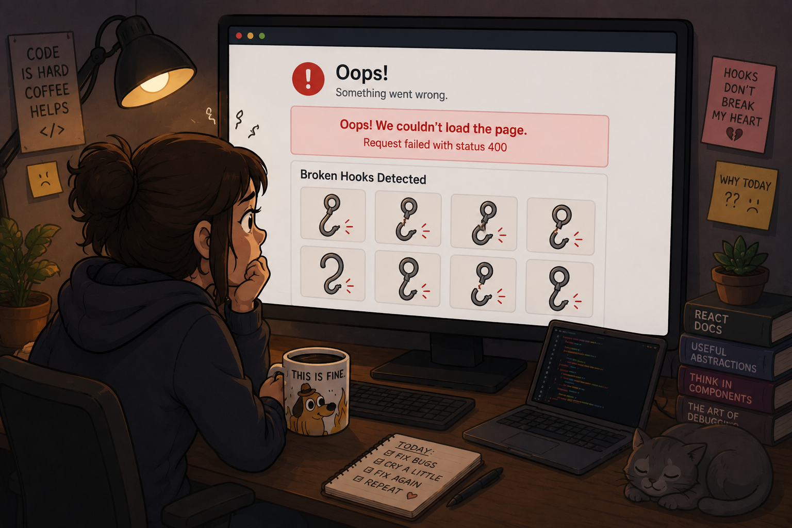

# Lab: Broken Hooks



## Introduction

Again, we have issues with previous code made by other developers and AI. It is supposed to fetch a list of users from the public JSONPlaceholder API, show them as a list of cards, let you mark any user as a favorite, and let you click a card to open that user's posts on the side.

It almost works. The components are there, the logic reads fine, the data is real. But the product does not behave the way it should, and the worst part, someone deployed this to production!.

This lab is also about a skill you will use every single day as a developer.

## The situation

Your manager tried the app in production, they fired the other poor guy 🙀, and left you this note:

"The functionality looks like it should be correct, but when I use the app two things are clearly off. Both of them show up once I start clicking around. One becomes obvious when I open a user, and the other one when I try to mark a user as a favorite. Please dig in and fix it. I am not going to tell you exactly what is wrong, because figuring that out is half the job."

That is all you get. The rest is on you.

## A hint, and only a hint

The problems are not in the styling and they are not in the API URLs. The data and the endpoints are correct.

Everything you need to find lives in the way the React components manage their work over time and the way they store and update their data. These are exactly the topics we covered in class this past week. If a behavior feels wrong, ask yourself when React decides to run your code again, and ask yourself whether your data is really changing in a way React can notice.

## Getting started

Install dependencies and run the development server:

```bash
npm install
npm run dev
```

Open http://localhost:3000 in your browser.

Before you change a single line, do this first:

1. Open the browser DevTools. Keep the Console tab and the Network tab visible.
2. Click a card to open a user, and watch the Network tab. Look for anything that repeats, anything that never stops, or anything that complains.
3. Click the favorites button on a card. Watch whether the screen reacts the way you would expect.
4. Click a different card and confirm the side panel really follows the user you picked.

## Your job

There are two separate problems. They are independent, so you can attack them one at a time.

1. One problem is about how a component runs its work over time. Something is happening more often than it should, or at the wrong moment.
2. The other problem is about how a component stores and updates its data. You perform an action, the data should change on screen, and it does not.

Your task is to find both, understand why each one happens, and fix them without rewriting the whole app. The structure of the code is fine. The fixes are small. Resist the urge to rewrite large chunks of working logic.

## How to work through this

**MANDATORY:** As you go, fill in `NOTES.md`. That file is part of the deliverable, not an afterthought. Write your first impressions there before you ask anyone or anything for help.

Work like a detective, not like someone copying an answer.

1. Reproduce the problem on purpose and describe out loud what you see.
2. Form a theory about why it happens. Write it down before you test it.
3. Find the exact lines responsible. The whole app lives in `app/page.js`, `app/components/`, and `app/lib/`. Read every file slowly.
4. Make the smallest change that fixes the behavior, then confirm it in the browser.
5. Repeat for the second problem.

## Checklist before you call it done

1. Opening a user does not run in an endless loop. The Network tab fires once and then settles instead of firing the same request forever.
2. Marking a user as a favorite updates that card on screen immediately.
3. Clicking a user opens their posts on the side, and clicking a different user shows that other user's posts.
4. There are no warnings or errors in the console.
5. You did not rewrite the app. The fixes are small and targeted.
6. `NOTES.md` is filled in with your thinking, your questions, and your final solutions.

## If you finish early

1. Add a small loading skeleton for the posts instead of plain text.
2. Show how many favorites are currently selected somewhere on the page.
3. Add a search input that filters the list of users by name as you type.
4. Sort favorite users to the top of the list.

## Key concepts to review

1. When does a React effect run, and what makes it run again.
2. Why an effect that updates the same data it depends on can never settle.
3. Why React re renders a component, and why changing data in place is not enough to trigger it.
4. The difference between changing a value and giving React a new value to notice.
